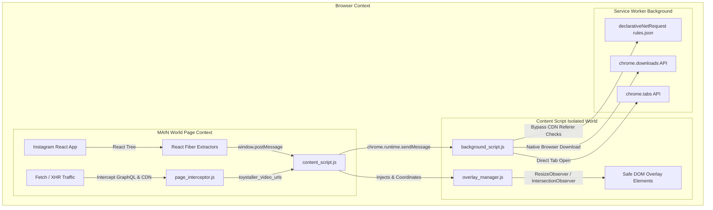

# 🧸 Toystaller: WhatsApp Edition (v6.0)

**High-Performance Media Downloader & Viewer for WhatsApp Web**

[](https://developer.chrome.com/docs/extensions/mv3/intro/)
[](https://web.whatsapp.com)
[](https://opensource.org/licenses/MIT)
[](https://github.com/SudiptaSanki/Toystaller-WhatsApp)

> *A specialized Chromium extension that extracts and downloads original decrypted images, videos, and status updates directly from WhatsApp Web without third-party services or quality loss.*

---

## 📌 Repository Links

* **WhatsApp Specialized Edition:** [https://github.com/SudiptaSanki/Toystaller-WhatsApp](https://github.com/SudiptaSanki/Toystaller-WhatsApp)
* **Instagram Specialized Edition:** [https://github.com/SudiptaSanki/Toystaller-Instagram](https://github.com/SudiptaSanki/Toystaller-Instagram)
* **Global Multi-Platform Suite:** [https://github.com/SudiptaSanki/Toystaller](https://github.com/SudiptaSanki/Toystaller)

---

## 🌟 Overview

**Toystaller: WhatsApp Edition** is engineered specifically for WhatsApp Web's single-page architecture (`web.whatsapp.com`). 

WhatsApp Web decrypts incoming media in-browser into local `blob:` objects. Standard browser download extensions fail on WhatsApp Web because external background processes cannot cross origin boundaries to access decrypted blob streams.

Toystaller operates **100% client-side** inside WhatsApp Web's page context. It identifies decrypted media objects, provides instant download buttons, and triggers direct file downloads with clean, timestamped filenames.

---

## ⚡ Supported WhatsApp Web Sections

| WhatsApp Section | Supported Media | Download Action | Placement & Isolation |
| :--- | :--- | :--- | :--- |
| **Chat Conversation (`wa-chat`)** | Received & Sent Photos, Videos | Direct 1-Click Download (`.jpg`, `.mp4`) + Open in New Tab | Clamped corner button inside message bubble with smart hover |
| **Status Viewer (`wa-status`)** | Fullscreen Status / Story Updates | Download full status video or photo | Non-intrusive placement avoiding progress bars; prevents story skipping |
| **Media Lightbox (`wa-media-viewer`)** | Fullscreen Opened Photos & Videos | Download maximum-resolution media | Strict modal isolation; avoids WhatsApp's close/forward toolbar |
| **Contact / Group Info (`wa-profile`)** | Profile Avatars & Shared Media Grid | Download profile pictures and gallery media | Non-intrusive hover buttons on media gallery items |

---


## 🛠️ Technology Stack & Architecture

Toystaller is built from the ground up with **Pure Modern Vanilla JavaScript** (ES2022+), zero third-party dependencies, and adheres strictly to **Google Chrome Manifest V3 specifications**.



### Core Technologies:
1. **Manifest V3 Service Worker (`background_script.js`)**:
   - Manages asynchronous download pipelines via `chrome.downloads`.
   - Intercepts raw network response headers with `chrome.webRequest` for fallback URL tracking.
2. **Declarative Net Request Header Rewriting (`rules.json`)**:
   - Instagram CDN (`*.cdninstagram.com`) blocks media downloads with `403 Forbidden` if loaded with external referrers. Toystaller uses `declarativeNetRequest` rules to spoof proper Instagram headers on the fly.
3. **Main-World React Fiber Hooking (`page_interceptor.js`)**:
   - Seamlessly accesses DOM elements' hidden `__reactFiber$` and `__reactProps$` internal keys.
   - Extracts complete `video_versions` (highest bitrate/height) and `image_versions2.candidates` (uncompressed resolution) directly from React's component state.
4. **Network Interceptor (`page_interceptor.js`)**:
   - Overrides `window.fetch` and `window.XMLHttpRequest` in the page context.
   - Captures Instagram GraphQL and media query responses in memory before they are decoded.
5. **Geometry & Occlusion Engine (`overlay_manager.js`)**:
   - Uses `IntersectionObserver`, `ResizeObserver`, and `document.elementsFromPoint` hit testing.
   - Dynamically calculates best corner placement avoiding native Instagram controls (Like, Comment, Mute, Close).
   - Real-time `MutationObserver` on modal dialogs to prevent overlay bleed across layers.
6. **Isolated Settings Dashboard (Shadow DOM)**:
   - Floating dark-mode control center rendered inside an isolated `ShadowRoot` to prevent any CSS interference from Instagram's stylesheets.

*(For exhaustive architectural diagrams and algorithms, read [`DETAILS.md`](DETAILS.md)).*

---

## Detailed Installation Guide (Step-by-Step)

To install and run **Toystaller: Instagram Edition** on any Chromium-based browser (Google Chrome, Brave, Microsoft Edge, Opera, Vivaldi, Arc):

### Prerequisites
- Any modern Chromium browser (Chrome 102+ recommended).
- Git installed on your machine (or download the source ZIP).

---

### Step 1: Clone or Download the Repository
Run the following command in your terminal:
```bash
git clone https://github.com/SudiptaSanki/Toystaller-Instagram.git
```
*Or click **Code ➔ Download ZIP** on GitHub and extract the folder to your preferred directory.*

---

### Step 2: Open Browser Extensions Page
1. Open your Chromium browser.
2. In the URL address bar, enter the corresponding URL:
   - **Google Chrome**: `chrome://extensions/`
   - **Brave Browser**: `brave://extensions/`
   - **Microsoft Edge**: `edge://extensions/`
   - **Opera**: `opera://extensions/`

---

### Step 3: Enable Developer Mode
Look in the top-right corner of the Extensions page and toggle the switch labeled **Developer mode** to **ON**.

```
                                  [ web.whatsapp.com ]
                                            │
                                            ▼
                           [ Signal Decryption / WA Web Core ]
                                            │
                        ┌───────────────────┴───────────────────┐
                        ▼                                       ▼
             [ Decrypted Image Blob ]                [ Decrypted Video Blob ]
                        │                                       │
                        └───────────────────┬───────────────────┘
                                            │
                                            ▼
                                [ Toystaller Content Core ]
                                 ├── platforms/whatsapp.js
                                 ├── overlay_manager.js
                                 └── core/content_core.js
                                            │
                        ┌───────────────────┴───────────────────┐
                        ▼                                       ▼
             [ 🟢 Download Button ]                  [ 🔵 Open in New Tab ]
           Triggers instant file download            Opens media in clean viewer
           (whatsapp_image_...jpg / .mp4)
```

### Key Engineering Features
1. **In-Page Blob Downloader**: Fetches client-side decrypted blob streams directly within the page context and saves them to your local downloads folder.
2. **Strict Modal Isolation**: When you open a Status update or click an image to view it in full size, background chat buttons are immediately suppressed to avoid visual noise.
3. **Event Propagation Shielding**: Prevents clicks on download buttons from bubbling up to WhatsApp's click listeners, ensuring statuses do not accidentally advance or close.
4. **Customizable Section Toggles**: Use the popup menu to selectively enable or disable overlays for Chat Media, Status Updates, Lightbox Viewer, or Profile Info.

---

## 🚀 Installation Guide

### Option A: Load Unpacked (Development)
1. Clone or download this repository:
   ```bash
   git clone https://github.com/SudiptaSanki/Toystaller-WhatsApp.git
   ```
2. Open Google Chrome (or any Chromium browser like Brave, Edge, Opera, Arc) and navigate to:
   ```
   chrome://extensions/
   ```
3. Enable **Developer mode** in the top-right corner.
4. Click **Load unpacked** in the top-left corner.
5. Select the project directory (`Toystaller-WhatsApp` or `Version 6/whatsapp`).
6. Open [WhatsApp Web](https://web.whatsapp.com/) and enjoy seamless media downloading!

---

## 📂 Project Structure

```
Toystaller-WhatsApp/
├── manifest.json              # Extension Manifest V3 (Toystaller: WhatsApp Edition)
├── background_script.js       # Background service worker
├── content_script.js          # Content script entry point
├── overlay_manager.js         # Modal-aware floating button positioning engine
├── popup.html                 # Popup settings dashboard
├── popup.js                   # Settings state manager
├── platforms/
│   └── whatsapp.js            # WhatsApp section classifier and media filter
├── core/
│   ├── background_core.js     # Shared background logic
│   ├── content_core.js        # Media extraction and direct blob downloader
│   ├── interceptor_core.js    # In-page network interceptor
│   └── overlay_manager.js     # Overlay manager core
└── Version 6/
    ├── instagram/             # Preserved Instagram Edition (user-managed)
    └── whatsapp/              # Version 6 standalone modular WhatsApp Edition
        ├── manifest.json
        ├── background.js
        ├── content.js
        ├── platform.js
        ├── popup.html
        ├── popup.js
        ├── icon.png
        └── core/
            ├── background_core.js
            ├── content_core.js
            ├── interceptor_core.js
            └── overlay_manager.js
```

---

## 🔒 Privacy & Security

* **Zero External Calls**: All media extraction and downloads occur entirely on your local machine within `web.whatsapp.com`.
* **Zero Telemetry**: No analytics, telemetry, or user tracking.
* **Open Source**: Complete transparency under the MIT License.

---

## 📄 License

MIT © [Sudipta Sanki](https://github.com/SudiptaSanki)
