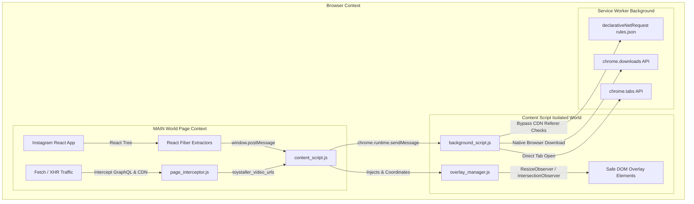

<div align="center">

# 🧸 Toystaller: Instagram Edition (v6.0)

**High-Performance, Stealth Media Downloader & Media Viewer for Instagram**

[](https://developer.chrome.com/docs/extensions/mv3/intro/)
[](https://instagram.com)
[](https://github.com/SudiptaSanki/Toystaller)
[](LICENSE)
[](DETAILS.md)

*A specialized, client-side Chromium extension that extracts original master HD videos and uncompressed photos from Instagram Reels, Stories, Profile Grids, Post Modals, and Direct Messages without external APIs or compression.*

---

### 🌐 Official Repositories & Documentation
* **Main Global Multi-Platform Suite:** [https://github.com/SudiptaSanki/Toystaller](https://github.com/SudiptaSanki/Toystaller) *(Instagram, Facebook, LinkedIn, WhatsApp)*
* **Instagram Specialized Edition:** [https://github.com/SudiptaSanki/Toystaller-Instagram](https://github.com/SudiptaSanki/Toystaller-Instagram)
* **Deep Technical Specification & Architecture:** [`DETAILS.md`](DETAILS.md)

</div>

---

##  Overview

**Toystaller: Instagram Edition** is an advanced browser extension engineered specifically for Instagram's modern single-page React application. Traditional downloaders rely on server-side scrapers that require you to paste links into ad-filled websites, or they scrape low-resolution `blob:` preview URLs from the DOM.

Toystaller operates **100% client-side** inside your browser. It directly accesses Instagram's internal React Fiber tree and network buffers to extract the original, full-resolution master MP4 videos and maximum-quality photos directly from Instagram's official CDN (`*.cdninstagram.com`).

---

## Features & Section Support

| Instagram Section | Supported Media | Extraction Capability | UI & Behavior |
| :--- | :--- | :--- | :--- |
| **Profile Grid (`/<username>/`)** | Images, Reels & Video Previews | Full-res photos, original video streams, high-res avatar | Hover over grid tiles for unobtrusive buttons; avatar supports direct download |
| **Post & Reel Modals (`[role="dialog"]`)** | Single Photos, Videos, Multi-slide Carousels | Maximum resolution candidates (`1080x1350`, `1440p`), master MP4s | **Zero-Bleed Isolation**: Instantly suppresses background grid overlays |
| **Reels Feed (`/reels/`, `/reel/<id>/`)** | Vertical Video Player | Progressive MP4 video stream + High-res poster image | Smart corner positioning in top/bottom-left avoiding Instagram like/sound controls |
| **Main Feed (`/`)** | Single Posts, Videos, Carousels | Highest width image from `srcset` or React Fiber master URL | Ignores story tray avatars and comment icons to keep feed clean |
| **Stories (`/stories/<username>/<id>/`)** | Video Stories & Photos | Active story media stream without overlays | Positioned safely below story progress indicator |
| **Direct Messages (`/direct/`)** | Shared Photos & Videos | Original quality media attachments | Compact button scaling; ignores chat participant avatars |

---


## 🛠️ Technology Stack & Architecture

Toystaller is built from the ground up with **Pure Modern Vanilla JavaScript** (ES2022+), zero third-party dependencies, and adheres strictly to **Google Chrome Manifest V3 specifications**.



### Core Technologies:
1. **Manifest V3 Service Worker (`background_script.js`)**:
   - Manages asynchronous download pipelines via `chrome.downloads`.
   - Intercepts raw network response headers with `chrome.webRequest` for fallback URL tracking.
2. **Declarative Net Request Header Rewriting (`rules.json`)**:
   - Instagram CDN (`*.cdninstagram.com`) blocks media downloads with `403 Forbidden` if loaded with external referrers. Toystaller uses `declarativeNetRequest` rules to spoof proper Instagram headers on the fly.
3. **Main-World React Fiber Hooking (`page_interceptor.js`)**:
   - Seamlessly accesses DOM elements' hidden `__reactFiber$` and `__reactProps$` internal keys.
   - Extracts complete `video_versions` (highest bitrate/height) and `image_versions2.candidates` (uncompressed resolution) directly from React's component state.
4. **Network Interceptor (`page_interceptor.js`)**:
   - Overrides `window.fetch` and `window.XMLHttpRequest` in the page context.
   - Captures Instagram GraphQL and media query responses in memory before they are decoded.
5. **Geometry & Occlusion Engine (`overlay_manager.js`)**:
   - Uses `IntersectionObserver`, `ResizeObserver`, and `document.elementsFromPoint` hit testing.
   - Dynamically calculates best corner placement avoiding native Instagram controls (Like, Comment, Mute, Close).
   - Real-time `MutationObserver` on modal dialogs to prevent overlay bleed across layers.
6. **Isolated Settings Dashboard (Shadow DOM)**:
   - Floating dark-mode control center rendered inside an isolated `ShadowRoot` to prevent any CSS interference from Instagram's stylesheets.

*(For exhaustive architectural diagrams and algorithms, read [`DETAILS.md`](DETAILS.md)).*

---

## Detailed Installation Guide (Step-by-Step)

To install and run **Toystaller: Instagram Edition** on any Chromium-based browser (Google Chrome, Brave, Microsoft Edge, Opera, Vivaldi, Arc):

### Prerequisites
- Any modern Chromium browser (Chrome 102+ recommended).
- Git installed on your machine (or download the source ZIP).

---

### Step 1: Clone or Download the Repository
Run the following command in your terminal:
```bash
git clone https://github.com/SudiptaSanki/Toystaller-Instagram.git
```
*Or click **Code ➔ Download ZIP** on GitHub and extract the folder to your preferred directory.*

---

### Step 2: Open Browser Extensions Page
1. Open your Chromium browser.
2. In the URL address bar, enter the corresponding URL:
   - **Google Chrome**: `chrome://extensions/`
   - **Brave Browser**: `brave://extensions/`
   - **Microsoft Edge**: `edge://extensions/`
   - **Opera**: `opera://extensions/`

---

### Step 3: Enable Developer Mode
Look in the top-right corner of the Extensions page and toggle the switch labeled **Developer mode** to **ON**.

```
[ Developer mode ]  <--- (Toggle this to ON)
```

---

### Step 4: Load Unpacked Extension
1. Click on the **Load unpacked** button in the top-left toolbar.
2. In the folder selection dialog, navigate to and select the root project directory:
   ```
   Toystaller-Instagram/
   ```
   *(Ensure you select the folder containing `manifest.json`).*
3. Click **Select Folder** (or **Open**).

---

### Step 5: Pin and Verify the Extension
1. Click the **Puzzle icon** (Extensions menu) in your browser toolbar.
2. Locate **Toystaller: Instagram Edition** and click the **Pin icon** to pin it to your toolbar.
3. Open [Instagram](https://www.instagram.com/) or refresh any existing Instagram tab.
4. Hover over any post, reel, story, or profile picture — you will see the **Blue (Open Media)** and **Red (Open Poster)** overlay buttons!

---

##  How to Use

1. **Download / Open Video in New Tab**:
   - Hover over any Reel or Video.
   - Click the **Blue Button** with the arrow icon. The highest quality master MP4 link will open in a new tab for instant playback or saving (`Ctrl + S`).
2. **Download / Open High-Res Photo**:
   - Hover over any post image or profile picture.
   - Click the **Blue Button** to open the uncropped master photo.
3. **Open Poster / Video Thumbnail**:
   - Hover over any video.
   - Click the **Red Button** to extract the full-size video cover artwork.
4. **Open Settings Dashboard**:
   - Click the Toystaller icon in your browser toolbar to toggle the dashboard overlay.

---

## 📂 Project Structure

```text
Toystaller-Instagram/
├── manifest.json            # Extension manifest (MV3, permissions, content scripts)
├── background_script.js     # Background Service Worker for downloads & webRequest
├── content_script.js        # Content script orchestrator & button injection
├── overlay_manager.js       # Smart DOM positioning, collision & modal isolation
├── page_interceptor.js      # Main-world Fetch/XHR interceptor & React Fiber reader
├── rules.json               # DeclarativeNetRequest header spoofing rules
├── Toystaller_logo.png      # Extension branding & icons
├── platforms/
│   └── instagram.js         # Dedicated Instagram section detector & quality extractors
├── core/                    # Modular core architecture
│   ├── background_core.js
│   ├── content_core.js
│   ├── interceptor_core.js
│   └── overlay_manager.js
├── DETAILS.md               # Exhaustive technical documentation & architecture guide
├── LICENSE                  # MIT License
└── README.md                # Project documentation & installation manual
```

---

## 🛡️ Privacy & Security

- **100% Client-Side**: No user data, cookies, authentication tokens, or media URLs are ever transmitted to external servers.
- **Zero Third-Party Trackers**: No analytics, telemetry, or third-party dependencies.
- **Direct CDN Streams**: Media files are fetched directly from Instagram's official CDN servers (`*.cdninstagram.com`).

---

## 🤝 Contributing & Support

Contributions, feature suggestions, and bug reports are warmly welcome!
- Check out the **Main Global Repository** for multi-platform support (Instagram, Facebook, LinkedIn, WhatsApp): [https://github.com/SudiptaSanki/Toystaller](https://github.com/SudiptaSanki/Toystaller)
- Read the **Technical Architecture Guide**: [`DETAILS.md`](DETAILS.md)
- Open an Issue or Pull Request on [GitHub Issues](https://github.com/SudiptaSanki/Toystaller-Instagram/issues).

---
